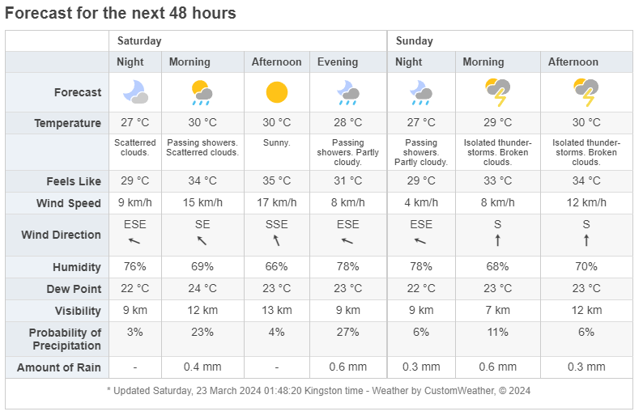
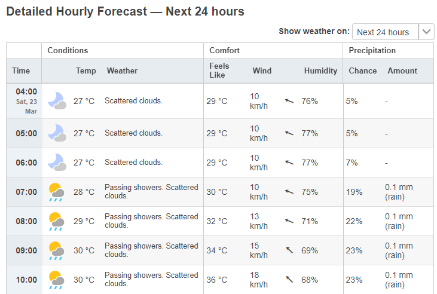
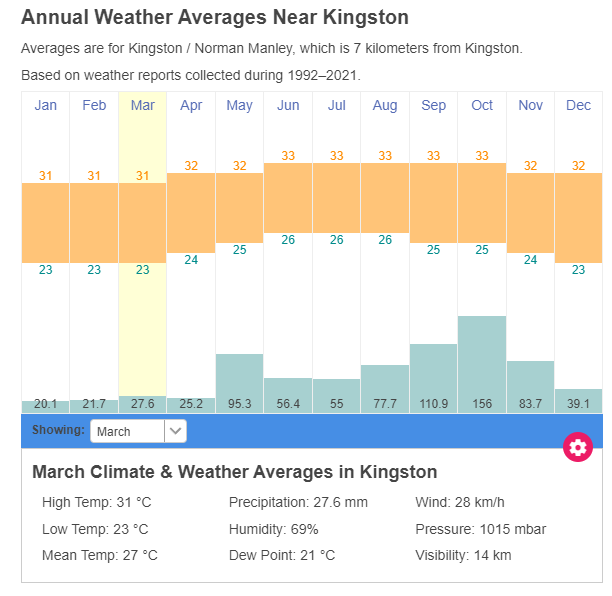

```{r setup, include=FALSE}
knitr::opts_chunk$set(echo = TRUE)
```


## Exercise 1

*Find a city that starts with the same letter as your first name on https://www.timeanddate.com/weather/. Only use cities that have both weather and climate tables available.*

*Retrieve the data from the summary table "Forecast for the next 48 hours". (Weather symbols can be ignored.) Output a table that summarizes this information. (Edit to clarify: "summarize" might be misleading here, the table should contain the information you scraped.)*

The city that was chosen is Kingston, located in Jamaica. This specific city was selected because, according to the exercise instructions, the choice had to be based on the first letter of the first name. Therefore, the URL used for the implementation of the first exercise is as follows: https://www.timeanddate.com/weather/jamaica/kingston. The specific URL includes the weather forecast for the city of Kingston for the next 48 hours. The goal is to utilize the web scraping capabilities of the R programming language to retrieve the table containing the forecasted values.

Initially, to achieve the above, the *rvest* library will be used. The *rvest* is a package embedded in R that will help us scrape data from the web. In addition to *rvest*, the libraries dplyr, *stringr*, *ggplot2*, and *lubridate* will be used. Not only for the first exercise but also for the others. The *dplyr* package is responsible for the processing pipeline and analysis of the data, the *stringr* package for text processing, the *ggplot2* package for the visualization part, and finally the *lubridate* package for the nice formatting of dates and times.

The following code chunk is responsible for retrieving the table with the forecast for the next 48 hours.

```{r, echo=FALSE, warning=FALSE, message=FALSE}
# Import the proper libraries
# This codeblock will not be shown in the report
library(ggplot2)
library(dplyr)
library(stringr)
library(lubridate)
# These are for the format of the tables
library(knitr)
```


```{r, warning=FALSE}
library(rvest)
link.48hours <- "https://www.timeanddate.com/weather/jamaica/kingston"
page.48hours <- read_html(link.48hours)

table.48hours <- page.48hours %>%
  html_nodes("table") %>% 
  .[[3]] %>%
  html_table()
```

As it is evident from the code chunk, first we need to initialize the corresponding URL. Then, using the *read_html()* command, we read the entire HTML page. To retrieve the table, the pipe operator from dplyr will be used (%>%) along with the *html_nodes("table")* command. With this, we have the ability to retrieve all the tables on the specific HTML page in a form of a HTML code. The result in R will be a list with all the tables in HTML format, not as table format as language R requires. The desired HTML table is in the 3rd position of the list, which is why *.[[3]]* is used. Finally, to import the requested table with the 48-hour values in a tibble format, which is a data frame, the *html_table()* command is used.

Below the table is presented after it has been retrieved from the website. As it can be seen, some modifications are needed to make the table look more aesthetically pleasing and understandable. Along with the R table, the table is also presented as it appears on the website. Note that the image may have different values from the R table because each time the R Markdown is executed, it takes the values of the respective day and time. The image is therefore used just for demonstration purposes.

```{r, echo=FALSE, fig.cap="Website's Table (48 Hours values)", out.width = '100%'}

```

```{r, echo=FALSE}
knitr::kable(table.48hours, "pipe", caption = "Raw Forecast for the next 48 hours")
```

The steps followed to format the table are as follows:

1. Name all the columns of the tibble.
2. Make all the columns unique (otherwise we get an error).
3. Remove the last observation because it does not contain any useful information.
4. Remove the second observation because on the website, weather icons are used to represent the weather conditions, which cannot be displayed directly in the R table/tibble.
5. Names were added on the first and third observation, which are related to the information provided by the table.
6. Remove the arrow for the 6th observation. The use of the arrow symbol is to indicate the direction of the wind. However, in the table, it always points upwards, making its usage unnecessary.

```{r, echo=FALSE}
old.colnames <- colnames(table.48hours) # save the column names
# Start the preprocessing 
colnames(table.48hours) <- make.names(colnames(table.48hours))
colnames(table.48hours) <- make.unique(colnames(table.48hours))
# Remove the last observation
table.48hours <- table.48hours %>% 
   slice(1:(n() - 1))
# Remove the second observation about forecast because the symbol is not added to the table
table.48hours <- table.48hours %>% 
  filter(!row_number() %in% c(2))
# Add names of the 1 and 3 rows of the first column
table.48hours$X[1] <- "Daytime"
table.48hours$X[3] <- "Description of the weather"
# Remove the arrow
table.48hours <- table.48hours %>%
  mutate(across(everything(), ~ ifelse(row_number() == 6, gsub("↑", "", .), .)))
```

The modified table, with the retrieved data, will be:

```{r, echo=FALSE}
kable(table.48hours, "pipe", 
      caption = "Raw Forecast for the next 48 hours after modifications",
      col.names = old.colnames, booktabs = TRUE)
```

\newpage

## Exercise 2

*Visualize the predicted development of temperature, wind, and humidity for the next 24 hours (retrieve the data from "Detailed Hourly Forecast - Next 24 hours"). Date & times should be formatted nicely.*

The same procedure as the first exercise was followed in the second one, with the difference that in this specific exercise, the used URL (https://www.timeanddate.com/weather/jamaica/kingston/hourly) pertains to the measurements for the next twenty-four hours. The following code block illustrates how the data was retrieved from the "Detailed Hourly Forecast - Next 24 hours":

```{r, warning=FALSE}
link.24hours <- "https://www.timeanddate.com/weather/jamaica/kingston/hourly"
page.24hours <- read_html(link.24hours)

table.24hours <- page.24hours %>%
  html_nodes("table#wt-hbh") %>%
  .[[1]] %>%
  html_table()
```

The raw table, along with the image from the website, that is retrieved from the website are presented below. The note, which is mentioned in the exercise 1 regarding the values of from the website, applies here as well. Due to the fact, the table is quite long, the picture represents only the first 7 rows of the table.

```{r, echo=FALSE, fig.cap="Website's Table (24 Hours Values)", out.width = '100%'}

```

```{r, echo=FALSE}
kable(table.24hours, "pipe", 
      caption = "Raw Detailed Hourly Forecast - Next 24 hours")
```

It is obvious from the table, several insignificant details are included. Additionally, according to the exercise instructions, only the temperature, wind, and humidity are needed. Therefore, the following processing steps will be performed to extract the relevant information:

1. Name all the columns of the tibble.
2. Make all the columns unique (otherwise we get an error).
3. Remove the last.
4. Change the column names according to the first row.
5. Remove the first row.
6. Remove the columns: Weather, 'Feels Like', Chance and Amount 
7. Change the columns Temperature, Wind, Humidity by removing the symbols and the characters
8. Change the columns Temperature, Wind, Humidity to numeric

```{r, echo=FALSE}
process.pipeline.exercise.2 <- function(df){

  colnames(df) <- make.names(colnames(df))
  colnames(df) <- make.unique(colnames(df))
  # Remove the last row
  df <- df %>% 
    slice(1:(n() - 1))
  # Remove the second the seventh column
  df <- df %>%
    select(-c(2,7))
  # Col names to the first row and remove the first row
  colnames(df) <- df[1,]
  df <- df[-1,]
  # Remove the columns: Weather, `Feels Like`, Chance and Amount
  df <- df %>%
    select(-Weather, -`Feels Like`, -Chance, -Amount)
  # Change the column Temperature, Wind, Humidity to numeric
  df <- df %>%
    mutate(Temp = as.numeric(gsub("\\D", "", Temp)), 
           Wind = as.numeric(gsub("\\D", "", Wind)),
           Humidity = as.numeric(gsub("\\D", "", Humidity)))
  
}
final.table.24hours <- process.pipeline.exercise.2(table.24hours)
```

The final table, after the preprocessing, will be:

```{r, echo=FALSE}
kable(final.table.24hours, "pipe", 
      caption = "Raw Detailed Hourly Forecast - Next 24 hours after modifications",
      col.names = c("Time (Hours Date)", "Temperature (°C)", "Wind (km/h)", "Humidity (%)"))
```

The first column of the table contains both the time and the date of the measurements. However, the date is not particularly distinguishable from the table. For this reason, additional preprocessing is needed to format the date and time nicely. At this point, the *stringr* library is used for character processing, and *lubridate* is used to format the dates.  The following code block relates to the specific processing:

```{r}
today <- format(Sys.Date(), format = "%d-%m-%Y")
tomorrow <- format(Sys.Date() + 1, format = "%d-%m-%Y")
time.column <- substr(final.table.24hours$Time, 1, 5)
# Function to add today's and tomorrow's date
temp <<- FALSE
add_date <- function(time_str, position) {
  if ((substr(time_str, 1, 2) == "00" | temp) & (position != 1)){
    date <- tomorrow
    temp <<- TRUE
  }
  else{
    date <- today
  }
  return((paste(date,time_str, sep = " ")))
}
final.table.24hours$Time <- sapply(seq_along(time.column), 
                                   function(i) add_date(time.column[i], i), 
                                   USE.NAMES = FALSE)
# Change the Time variable into factor
final.table.24hours$Time <- factor(final.table.24hours$Time, 
                                   levels =final.table.24hours$Time) 

```
The idea behind this particular code is that we want the first column of the table to contain both the time and the date, regardless of when we extract the data from the website. Initially, we check each time value (which is of type character) to see if the first two characters are "00". In this way, we aim to determine if there has been a change in the day within our measurements. Hence, the variables today and tomorrow are initialized at the beginning of the code.

However, there might be two potential issues. The first problem arises because our measurements may start at midnight and end at 11 PM on the same day. To address this, the condition *position != 1* is used. The second problem arises when there is a change in the day. From this point on wards, we want the date of the next day, not the previous one. To solve this issue, a Boolean variable named *temp* is used, as shown in the code. Therefore, the final table is presented below:

```{r, echo=FALSE}
kable(final.table.24hours, "pipe", 
      caption = "Final Detailed Hourly Forecast - Next 24 hours after modifications",
      col.names = c("Time (Hours Date)", "Temperature (°C)", "Wind (km/h)", "Humidity (%)"))
```

Finally, using the ggplot2 package, we were going to visualize the predicted development of temperature, wind, and humidity for the next 24 hours. The visualizations are line plots and they are shown below.

Initially, I would like to point out that the comments and analysis of the following diagrams concern the day the Rmarkdown file was executed.  The date is indicated at the beginning of the PDF report. The values may vary, as well as the diagrams, because according to the exercise instructions, the temperature, wind, and humidity values for the next 24 hours are needed.

Regarding the temperature (Figure 3), it is evident that throughout the day, the temperature rises, reaching its peak at midday (between 1 pm to 4 pm). From there on wards, the temperature decreases, reaching its minimum value during the late midnight hours. However, it is worth noting that the temperatures are quite high, and in combination with the humidity values during the day, it indicates that we are talking about an area close to the equator and therefore its climate is tropical. More specifically, from the humidity diagram (Figure 5), it is observed that it is inversely proportional (negative correlation) to the temperature. That is to say, during midday, the humidity is relatively low, while during the evening hours, when the sun sets or has set, it is particularly high.

Finally, the values of the wind during the day and night vary from day to day and from hour to hour. Generally, areas with a tropical climate are characterized by continuous and strong winds, which is evident from Figure 4. Also, there is a significant fluctuation in the values during the day and night. This means that the wind is not correlated with temperature and humidity.

Overall, as mentioned earlier, it is evident from the diagrams that Kingston, in Jamaica, has a tropical climate with very high temperatures and humidity, as well as significant fluctuations in strong winds.


```{r,echo=FALSE, fig.width=5,fig.height=4, fig.cap="Temperature Visualization"}
# Plot for temperature
ggplot(final.table.24hours, aes(x = Time, y = Temp, group = 1)) +
  geom_line() +
  labs(title = "Temperature Forecast - Next 24 hours",
       x = "Time",
       y = "Temperature (°C)") +
  theme_minimal() +
  theme(axis.text.x = element_text(angle = 90, vjust = 0.5)) 
```


```{r,echo=FALSE, fig.width=5,fig.height=4, fig.cap="Wind Visualization"}
# Plot for wind
ggplot(final.table.24hours, aes(x = Time, y = Wind, group = 1)) +
  geom_line() +
  labs(title = "Wind Forecast - Next 24 hours",
       x = "Time",
       y = "Wind (km/h)") +
  theme_minimal() +
  theme(axis.text.x = element_text(angle = 90, vjust = 0.5)) 
```

```{r,echo=FALSE, fig.width=5,fig.height=4, fig.cap="Humidity Visualization"}
# Plot for humidity 
ggplot(final.table.24hours, aes(x = Time, y = Humidity, group = 1)) +
  geom_line() +
  labs(title = "Humidity Forecast - Next 24 hours",
       x = "Time",
       y = "Humidity (%)") +
  theme_minimal() +
  theme(axis.text.x = element_text(angle = 90, vjust = 0.5))
```

\newpage

## Exercise 3

*Retrieve the monthly annual weather averages from "Climate (Averages) - Annual Weather Averages". Tip: It might be easier to use the climate table object (id: climateTable) than the graph to retrieve the information.*

- *Get the following summary statistics:*
  - *annual minimum, maximum, and mean temperature*
  - *annual mean precipitation*
- *Output a table and a plot for the monthly values (Edit to clarify: of the variables you analyzed in the point above).*


Just like in the previous two exercises, in this one you also need to retrieve the monthly annual weather averages from 'Climate (Averages) - Annual Weather Averages' at the URL https://www.timeanddate.com/weather/jamaica/kingston/climate. The problem at this point is that there is no table with the corresponding information, but rather a graph, which makes retrieving the necessary data difficult. However, below the graph, there are details provided for each month separately, as well as for the annual average values. The image below displays the information from the respective URL.

```{r, echo=FALSE, fig.cap="Website's Table (Monthly Values)", out.width = '100%'}

```


As shown in the image, to display the data for each month, there is a drop down component that allows us to select the desired month. However, the information is not in a table format but rather in text format. Additionally, if we inspect the HTML code at this specific point and view the HTML code, for the month of March, for example, we have initially a section with *id="climateTable"* and then *class="climate-month climate-month--march"*. For this reason, the following script code was used to retrieve the necessary information.

```{r, echo=TRUE}
link.annual<- "https://www.timeanddate.com/weather/jamaica/kingston/climate"
page.annual <- read_html(link.annual)
Time <- c("allyear", "january", 
          "february", "march", 
          "april", "may", 
          "june", "july", 
          "august", "september", "october", 
          "november", "december")

path <- "//div[@class='climate-month climate-month--"
all.path <- paste(path, Time, "']" ,sep = "")

annual.table <- data.frame()
for (p in all.path){
  info.annual <- page.annual %>% 
    html_node(xpath = p) %>%
    html_nodes("p") %>%
    html_text()

  annual.table <- rbind(annual.table,info.annual)
}
colnames(annual.table) <- c("High Temp", "Low Temp", 
                            "Mean Temp", "Precipitation", 
                            "Humidity", "Dew Point",
                            "Wind", "Pressure",
                            "Visibility")
```


Initially, we initialize the URL and read the HTML page in the same way as before. Then, we initialize a vector containing all the months as well as the annual average values. Additionally, we initialize the XML path and using the *paste* command, we concatenate the path with the months of the vector so that we ultimately have the format: *"//div[@class='climate-month climate-month--march"*, for the month of March, for example. Finally, an empty data frame is initialized, into which we will insert the retrieved values.

From this point on wards, a for loop is used to retrieve the values and store them in the form of a data frame. Within the loop, the *html_node(xpath = p)* function selects the node in the HTML document that matches the dynamically generated XPath selector, 'p'. This selector changes with each iteration of the loop to match the climate data for each month. Furthermore, *html_nodes("p")* is applied to the selected node to extract all elements within that node. Finally, *html_text()* is utilized to extract the text content from these elements. The retrieved data are presented below:

```{r, echo=FALSE}
kable(annual.table, "pipe", 
      caption = "Climate & Weather Averages in Kingston")
```


The raw format of the table needs further processing to remove unnecessary text. Additionally, only the columns "High Temperature", "Low Temperature", "Mean Temperature", and "Precipitation" are required according to the exercise. Thus, summary statistics of the annual minimum, maximum, mean temperature and annual mean precipitation along with the monthly values are presented to the two table below:

```{r, echo = FALSE}
# Choose the appropriate columns
annual.table <- annual.table[,1:4]

# Change the names of the columns
colnames(annual.table) <- c("High.Temperature","Low.Temperature","Mean.Temperature","Precipitation")

# Uppercase the first letter of each month
Time <- str_to_title(Time)
# Add the column with the months to the data frame
annual.table <- cbind(Time, annual.table)

# Remove the unnecessary text from the observations
annual.table <- annual.table %>%
  mutate(High.Temperature = as.numeric(gsub("[^0-9.]", "", High.Temperature)), 
         Low.Temperature = as.numeric(gsub("[^0-9.]", "", Low.Temperature)),
         Mean.Temperature = as.numeric(gsub("[^0-9.]", "", Mean.Temperature)),
         Precipitation = as.numeric(gsub("[^0-9.]", "", Precipitation)))

# Print out the Annual table
kable(annual.table[1,], "pipe", 
      caption = "Annual Climate & Weather Averages in Kingston",
      col.names = c("Mothns","High Temperature (°C)","Low Temperature (°C)",
                    "Mean Temperature (°C)","Precipitation (mm)"))

# Print out the monthly table
months.table <- annual.table[2:nrow(annual.table),]
rownames(months.table) <- NULL
kable(months.table, "pipe", 
      caption = "Monthly Climate & Weather Averages in Kingston",
      col.names = c("Months","High Temperature (°C)","Low Temperature (°C)",
                    "Mean Temperature (°C)","Precipitation (mm)"))
```

Below are the two visualizations for temperatures and precipitation, using the ggplot2 package again. 

Regarding the temperature chart (Figure 7), it is evident that temperatures are quite high throughout the year. Even during the winter period, the minimum temperature exceeds 22.5 degrees Celsius and reaches up to 32 degrees in December. It is worth noting that although winter temperatures are particularly high, there is no significant increase during the summer months, indicating that our region is relatively close to the equator, which is true. Finally, according to the mean values, the range of temperatures is quite limited (approximately 27 to 29 degrees), indicating that there are no significant fluctuations in temperature. This is another characteristic of areas close to the equator.

```{r, echo=FALSE, warning=FALSE, message=FALSE}
library(reshape2)
# Change the Time variable into factor
months.table$Time <- factor(months.table$Time, levels =months.table$Time)
# Transform the data to long format from wide format
dff.temperature <- melt(months.table[,1:4], id.var = "Time")
```

```{r,echo=FALSE, fig.width=6.5,fig.height=4, fig.cap="Temperature Visualization (Min/Max/Mean)"}
# Plot for the temperature variables
ggplot(dff.temperature, aes(x = Time, y = value, color = variable, group=variable)) +
  geom_line() +
  labs(title = "Annual Temperature Variation",
       x = "Months",
       y = "Temperature (°C)") +
  scale_color_manual(values = c("red", "blue", "green"),
                     labels = c("High Temperature", "Low Temperature", "Mean Temperature"),
                     name = "Temperature Type") +
  theme_minimal() +
  theme(axis.text.x = element_text(angle = 90, vjust = 0.5))
```


Regarding the Precipitation chart (Figure 8), initially, from January to April, the values are similar (around 40 mm). A sudden local maximum occurs in May, followed by a decrease in June and July to around 60 mm. From August to October, there is a significant increase, with October reaching the maximum value. From then on (November and December), Precipitation decreases significantly, reaching values typical of the winter period. It is evident that based on these values, Kingston, Jamaica, is located near the equator, resulting in a tropical climate.


```{r,echo=FALSE, fig.width=5,fig.height=4, fig.cap="Precipitation Visualization"}
# Plot for the precipitation variable
ggplot(months.table, aes(x = Time, y = Precipitation, group = 1)) +
  geom_line() +
  labs(title = "Annual Precipitation Variation",
       x = "Months",
       y = "Precipitation") +
  theme_minimal() +
  theme(axis.text.x = element_text(angle = 90, vjust = 0.5))
```

