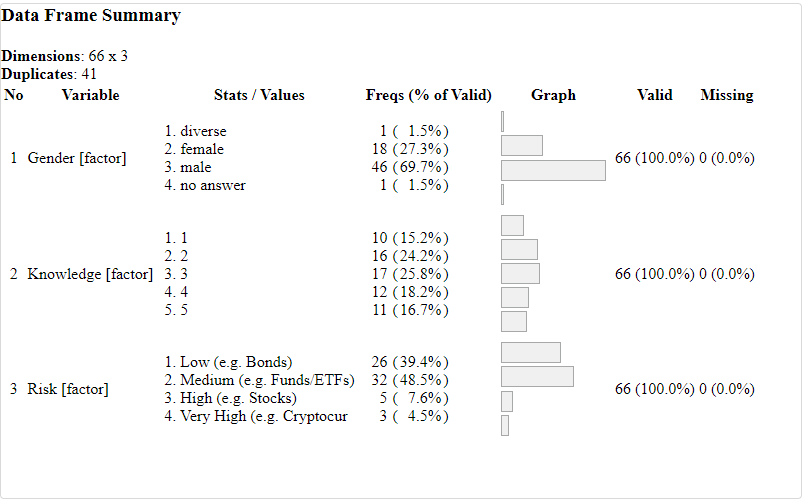

```{r setup, include=FALSE}
knitr::opts_chunk$set(echo = TRUE)
```

\newpage
# General

For this survey data analysis task we use the following packages:

- tidyverse
- knitr
- stringr
- ggplot2
- dplyr
- plotly
- summarytools


The first task is to install and load these required packages. Afterwards, we import the data from the csv file, explore the first rows and the initial structure of the data.

```{r, echo=FALSE, message=FALSE}
my_packages <- c("ggplot2", "dplyr", "tidyverse", "knitr", "plotly", 
                 "stringr", "summarytools", "readr")

for (p in my_packages) {
  if (!p %in% installed.packages()) {
    install.packages(p)
  }
}

```


```{r, echo=FALSE, message=FALSE, warning=FALSE}

library(tidyverse)
library(stringr)
library(knitr)
library(plotly)
library(ggplot2)
library(dplyr)
library(readr)
```

```{r, echo=FALSE}
# Load the data
data <- read.csv("group11.csv")

# View the first few rows of the dataset
# head(data)
# print(str(data))

#kable(str(data), caption = "str of data") 
#kable(head(data), caption = "Head of data") 
```

# Data Exploration & Cleaning

## Data Cleaning

### General
After exploring the structure of the data, we continue with tidying up the data and renaming the columns. 

- DemographicAnswer.1 -> Gender
- DemographicAnswer.2 -> Age
- DemographicAnswer.3 -> Programm
- Answer.1 -> Income
- Answer.2 -> Knowledge
- Answer.3 -> Risk


```{r, echo=FALSE}
# rename 
data <- data %>%
  rename(
    Gender = DemographicAnswer.1,
    Age = DemographicAnswer.2,
    Programm = DemographicAnswer.3,
    Income = Answer.1,
    Knowledge = Answer.2,
    Risk = Answer.3
    )
```


### Academic Program
Continued by the consolidation of the Academic Programs. As this is a free text field, we tried to group the different spellings together. We used "regex" for this task and ended up with only 7 different academic programs for the further investigation . Finally the column is converted to a factor datatype.

```{r, echo=FALSE}
# Count distinct values and their frequencies
distinct_counts <- data %>%
  count(Programm, sort = TRUE)

# Display the distinct values with counts
kable(distinct_counts, 
      col.names = c("Programm", "Number of students"),
      caption = "Different values from Academic Program") 

data <- data %>%
  mutate(Programm = str_to_title(Programm)) %>%
  mutate(Programm = case_when(
    str_detect(Programm, 
               regex("Science", ignore_case = TRUE)) ~ "Data Science MSc",
    Programm == "Tu Wien" ~ "TU Wien",
    str_detect(Programm, 
               regex("^Mathematics / MSc / Tu Wien$", 
                     ignore_case = TRUE)) ~ "Mathematics MSc",
    str_detect(Programm, 
               regex("^Bachelor For Mathematics$", 
                     ignore_case = TRUE)) ~ "Mathematics BSc",
    str_detect(Programm, 
               regex("^Medical Informatiocs/BSc/TU Wien$", 
                     ignore_case = TRUE)) ~ "Medical Informatics BSc",
    str_detect(Programm, 
               regex("^Bachelorstudium Software & Information Engineering$", 
                     ignore_case = TRUE)) ~ "SW Engineering BSc",
    str_detect(Programm, 
               regex("Business Informatics/MSc/ Tu Wien", 
                     ignore_case = TRUE)) ~ "Business Informatics MSc",
    str_detect(Programm, 
               regex("Business Informatics/MSc/Tu Wien", 
                     ignore_case = TRUE)) ~ "Business Informatics MSc"
  )) 

# Convert to a factor
data <- data %>%
  mutate(Programm = as.factor(Programm))

## Count the cleaned values
cleaned_counts <- data %>%
   count(Programm, sort = TRUE)

##Display the cleaned counts
kable(cleaned_counts, 
      col.names = c("Programm", "Number of students"),
      caption = "Final values from Academic Program") 


```


### Gender

The column Gender is converted to a factor. There is no sort order for this value.

```{r, echo = FALSE}
### cleaning - Gender
# Convert to a factor
data <- data %>%
  mutate(Gender = as.factor(Gender))
```


### Knowledge Level 

The column Knowledge (Level of Knowledge) is converted to a factor. The values are numbers and ordered ascending. 

```{r, echo = FALSE}
### cleaning - Knowledge Level 
# Convert to a factor and order
data <- data %>%
  mutate(Knowledge = as.factor(Knowledge))
```

### Investment Risk

To clean the risk column we convert it to a factor and put the levels into the right order: 
\begin{center}
Low -> Medium -> High -> Very High
\end{center}


```{r, echo = FALSE}
### cleaning - Investment Risk
# Convert to a factor and order
data <- data %>%
  mutate(Risk = as.factor(Risk))

# get the risk factor into the right order
data <- data %>%
  mutate(Risk = fct_relevel(Risk,
    "-",
    "Low (e.g. Bonds)",
    "Medium (e.g. Funds/ETFs)",
    "High (e.g. Stocks)",
    "Very High (e.g. Cryptocurrency - Bitcoin, Ethereum)"
))


## Count distinct values and their frequencies
#distinct_counts <- data %>%
#  count(Risk, sort = TRUE)
#
## Display the distinct values with counts
#print(distinct_counts)

```

### Data Set Schema

To provide the same clean dataset for all questions, save it to a data frame, named "data_clean". This is used for all questions to start with their individual preparations. Below is the schema of the data frame, which will be used for answering and analyzing our research questions.

```{r, echo = FALSE}
# provide the clean data for all research questions
data_clean <- data
str(data_clean)
```
In the table below, the final form of our data is presented after the data cleaning process was completed. Since we have a total of 66 observations, only the first five observations are presented to give you an idea of the structure of our data.

```{r, echo = FALSE}
kable(head(data_clean), 
      format = , 
      caption = "Final structure of the data set")
```

## Data Exploration

### Gender

In the bar chart below, the gender distribution is presented. It is evident that male students outnumbered female students, because they are twice as many. Only one student has answered as diverse gender, and one has not answered the question at all.

```{r, echo=FALSE, warning=FALSE}
### Data Distribution - Gender
# Plot histogram
ggplot(data, aes(x = Gender)) +
  geom_bar(fill = "steelblue") +
  labs(title = "Gender Distribution", x = "Gender", y = "Count") +
  theme_minimal()+
  theme(
    plot.title = element_text(hjust = 0.5, size = 20, face = "bold"),
    axis.title = element_text(size = 15),
    axis.text = element_text(size = 12)
  )
```

### Age

The next chart shows the age distribution of the students. From the histogram, it is clear, with the help of the red vertical line, that the average age is 27.5 years. However, it is observed that the distribution is skewed to the right, which means that ages over 30 are outliers and raise the average age. Hypothetically speaking, if we remove these outlier students, the average age decreases to 23 to 24 years.

```{r, echo=FALSE, warning=FALSE}
### Data Distribution - 
# Plot histogram
# Custom theme and annotations
ggplot(data, aes(x = Age)) +
  geom_bar(fill = "steelblue", color = "black") +
  labs(title = "Age Distribution", x = "Age", y = "Count") +
  theme_minimal() +
  theme(
    plot.title = element_text(hjust = 0.5, size = 20, face = "bold"),
    axis.title = element_text(size = 15),
    axis.text = element_text(size = 12)
  ) +
  geom_vline(aes(xintercept = mean(Age, na.rm = TRUE)),
             color = "red", linetype = "dashed", size = 1) +
  annotate("text", x = mean(data$Age, na.rm = TRUE), y = max(table(data$Age)) - 1, 
           label = paste("Mean Age:", round(mean(data$Age, na.rm = TRUE), 1)),
           color = "red", size = 4, vjust = -0.5)

```

### Academic Program

At this point, we will discuss how the academic programs are distributed. Specifically, we will observe which academic programs the students belong to and identify the most frequent one. From the bar chart, it appears that approximately 97% of the students belong to the Data Science Master's program. This result is expected because the course Data Acquisition and Survey Methods is entirely part of the Data Science curriculum.

```{r, echo=FALSE}
### Data Distribution - Academic Program
# Create the bar plot
ggplot(data, aes(x = Programm)) +
  geom_bar(fill = "steelblue") +
  labs(title = "Academic Program Distribution", x = "Academic Program", y = "Count") +
  theme_minimal() +
  theme(
    plot.title = element_text(hjust = 0.5, size = 20, face = "bold"),
    axis.title = element_text(size = 15),
    axis.text = element_text(size = 12),
    axis.text.x = element_text(angle = 90, vjust = 0.5, hjust = 1)  # Make the x-axis text vertical
  )
```

### Investment Percentage

Subsequently, the histogram below presents the distribution of the percentage of income, indicating how much percentage of their income students invest in financial investments. From the distribution, it is clear that a large percentage of students do not invest at all in financial investments, making the average percentage of income invested 15.5%. Finally, it is worth noting that one student invests their entire income in investments, which is particularly ambitious.

```{r, echo=FALSE}
### Data Distribution - Investment Percentage
# Plot histogram
# Custom theme and annotations
ggplot(data, aes(x = Income)) +
  geom_bar(fill = "steelblue", color = "black") +
  labs(title = "Investment Percentage Distribution", x = "Percentage", y = "Count") +
  theme_minimal() +
  theme(
    plot.title = element_text(hjust = 0.5, size = 20, face = "bold"),
    axis.title = element_text(size = 15),
    axis.text = element_text(size = 12)
  ) +
  geom_vline(aes(xintercept = mean(Income, na.rm = TRUE)),
             color = "red", linetype = "dashed", size = 1) +
  annotate("text", x = mean(data$Income, na.rm = TRUE), y = max(table(data$Income)) - 1, 
           label = paste("Mean Percentage:", round(mean(data$Income, na.rm = TRUE), 1)),
           color = "red", size = 4, vjust = -0.5)

```

### Knowledge Level 

In the figure below, the knowledge level distribution is presented, indicating how familiar or not are the students regarding the financial investments. As shown in the bar chart, many students have a basic or more advanced knowledge of them, as only 11 students have no knowledge at all. It is worth noting that the levels from 1 to 5 indicate:

\begin{itemize}
    \item 1 - Very familiar
    \item 2 - Somewhat familiar
    \item 3 - Moderately familiar
    \item 4 - Not very familiar
    \item 5 - Not familiar at all
\end{itemize}


```{r, echo=FALSE}
### Data Distribution - Knowledge Level 
# Plot histogram
# Custom theme and annotations
ggplot(data, aes(x = Knowledge)) +
  geom_bar(fill = "steelblue", color = "black") +
  labs(title = "Knowledge Level Distribution", x = "Level", y = "Count") +
  theme_minimal() +
  theme(
    plot.title = element_text(hjust = 0.5, size = 20, face = "bold"),
    axis.title = element_text(size = 15),
    axis.text = element_text(size = 12)
  )
```

### Risk Level 

Finally, the last chart to complete the exploratory data analysis is shown below. Specifically, it presents on which level of risk (investment type) the students primarily allocate or would allocate their savings. It is observed that a large portion of students do not seek to invest in financial investments that are considered high or very high risk. According to the data cleaning performed in the previous section, the mapping is as follows:

\begin{itemize}
    \item Low : Low (e.g. Bonds)
    \item Medium : Medium (e.g. Funds/ETFs)
    \item High : High (e.g. Stocks)
    \item Very High :  Very High (e.g. Cryptocurrency - Bitcoin, Ethereum)
\end{itemize}

```{r, echo=FALSE}
### Data Distribution - Risk Level 
# Plot histogram
# Custom theme and annotations
# rename the risk levels (remove the explanations) for better visualizing
data_vis <- data %>%
  mutate(Risk = fct_recode(Risk,
               "Low" = "Low (e.g. Bonds)", 
               "Medium" = "Medium (e.g. Funds/ETFs)",
               "High" = "High (e.g. Stocks)", 
               "Very High"= "Very High (e.g. Cryptocurrency - Bitcoin, Ethereum)" 
                ))


ggplot(data_vis, aes(x = Risk)) +
  geom_bar(fill = "steelblue", color = "black") +
  labs(title = "Risk Level Distribution", x = "Level", y = "Count") +
  theme_minimal() +
  theme(
    plot.title = element_text(hjust = 0.5, size = 20, face = "bold"),
    axis.title = element_text(size = 15),
    axis.text = element_text(size = 12)
  )
```


\newpage

# Research Question 1 
(by Daniel Kancsar)

Are data science students with zero or low levels of investment experience more likely to prioritize safety, preferring conservative options like bonds or funds, while active investors are expected to display higher risk tolerance, favoring riskier assets?

## Main steps in the data analysis

### Get the cleaned data. 

To begin the analysis, the cleaned dataset is loaded, which includes all responses to the survey.

```{r, echo=FALSE}
data <- data_clean
```

### Data preparation

For accurate analysis, it is essential to preprocess the data. Specifically, any missing risk values are treated as "Low" risk to maintain consistency in the dataset. This extra data preprocessing step is done only for this research question.

```{r, echo=FALSE}
# Replace "-" with "Low (e.g. Bonds)" if necessary
data <- data %>%
  mutate(Risk = recode(Risk, "-" = "Low (e.g. Bonds)"))
```

### Create Descriptive Inference

The summary statistics for the numerical variables in the dataset, such as age and income, are examined to understand the general demographic distribution of the respondents. 

```{r, echo=FALSE}
numerical_summary <- data %>%
  select(Age, Income) 

numerical_summary <- do.call(cbind, lapply(numerical_summary, function(x) c(summary(x), sd(x))))

n <- nrow(numerical_summary)

# Add the row name for the SD
row.names(numerical_summary)[n] <-"Standard Deviation"

```

```{r, echo=FALSE}
kable(numerical_summary, 
      format = , 
      caption = "Summary Statistics for Question 1")
```


The summary statistics for the categorical variables, including gender, knowledge of investment options, and risk preference, are explored to provide insights into the distribution of these categories within the sample.


```{r, echo=FALSE}
categorical_summary <- data %>%
  select(Gender, Knowledge, Risk) %>%
  summarytools::dfSummary()

summarytools::st_options(plain.ascii     = FALSE,       
                         dfSummary.style = "grid",
                         dfSummary.graph.magnif = .75,
                         footnote        = NA)

print(categorical_summary, method = "render")

```


```{r, echo=FALSE, out.width="70%", fig.cap="Summary Statistics Categorical Values", fig.align="center"}

```


### Create Analytic Inference

Hypothesis:

Null Hypothesis (H0): There is no association between the level of investment experience and the type of investment risk chosen by data science students.
Alternative Hypothesis (H1): There is an association between the level of investment experience and the type of investment risk chosen by data science students.

To focus the analysis on data science students, the dataset is filtered to include only those enrolled in the "Data Science MSc" program.

A contingency table is created to examine the relationship between familiarity with investment options (Knowledge) and the type of investment risk (Risk). This table provides a cross-tabulation of the frequency counts between these two categorical variables. The bar plot visualizes this relationship, making it easier to identify patterns and trends.

```{r echo=FALSE}
# Filtering Data for "Data Science MSc"
data <- data %>%
  filter(Programm == "Data Science MSc")

contingency_table <- table(data$Knowledge, data$Risk)

contingency_df <- as.data.frame(contingency_table)

# Create a bar plot for the contingency table
ggplot(contingency_df, aes(Var1, Freq, fill = Var2)) +
  geom_bar(stat = "identity", position = "dodge") +
  labs(title = "Familiarity vs. Risk Level", 
       x = "Familiarity", 
       y = "Frequency", 
       fill = "Risk Level")
```

To better understand the proportions, the contingency table is normalized. Normalization adjusts the counts in each category so that they sum to one, allowing for the comparison of relative frequencies rather than absolute counts. This approach helps in identifying whether certain knowledge levels are disproportionately associated with particular risk preferences. The corresponding bar plot visualizes these normalized proportions.

```{r echo=FALSE}
normalized_contingency_table <- prop.table(contingency_table, margin = 1)
# Convert the normalized contingency table to a data frame for ggplot
normalized_contingency_df <- as.data.frame(normalized_contingency_table)

# Create a bar plot for the normalized contingency table
ggplot(normalized_contingency_df, aes(Var1, Freq, fill = Var2)) +
  geom_bar(stat = "identity", position = "dodge") +
  labs(title = "Familiarity vs. Risk Level (Normalized)", 
       x = "Familiarity", 
       y = "Proportion", 
       fill = "Risk Level")
```

A Chi-Square test is performed to statistically assess the association between the level of investment experience and the type of investment risk chosen by data science students.

```{r echo=FALSE, warning=FALSE, results='hide'}
# Create a contingency table
contingency_table <- table(data$Knowledge, data$Risk)

# Perform Chi-Square test
chi_square_test <- chisq.test(contingency_table)

# Display the test results
print(chi_square_test)
```

```{r, echo=FALSE}
# Creating a data frame with the test results
chi_squared_results <- data.frame(
  Statistic = c("p-value"),
  Value = c(0.07863)
)

# Using kable to create the table
kable(chi_squared_results, col.names = c("Statistic", "Value"), caption = "Pearson's Chi-squared Test Results")
```


Chi-Square Test Results

The Chi-Square test was conducted to investigate the association between the level of investment experience (Knowledge) and the type of investment risk (Risk) among data science students. 

Findings:

The p-value (0.07863) is slightly above the commonly used significance level of 0.05. This means that we fail to reject the null hypothesis at the 0.05 significance level.
However, the p-value is close to 0.05, indicating a potential trend towards significance. This suggests that there might be some association between investment experience and risk preference, but the evidence is not strong enough to conclusively support it at the 0.05 level.

\newpage
# Research Question 2
(by Konstantinos Vakalopoulos)

At this point in our project and analysis we will address the question: "Is there a significant relationship between age with percentage of income, which is allocated to financial investments, among university students, irrespective of gender and academic program?". In particular, based on this question we want to determine whether: "Older university students will invest a higher percentage of their income to financial investments compared to younger students, irrespective of gender and academic program".

First, a basic loading and preparation of the data as well as a descriptive analysis of the data is presented. Then, an exploratory data analysis is carried out and more specifically 3 plots that will help us to understand the data in more detail. Afterwards, the analysis of our hypothesis and research question is started with the introduction of a scatterplot and finally a statistical test and its interpretation are carried out.


## Load and prepare data

According to our hypothesis, our goal is to find if there is any correlation between the age of university students and the percentage of their income that they invest in financial investments. Thus, the two variables we will examine are age and the percentage of income, both of which are quantitative variables. Below, some basic steps for processing our data are presented, as well as the r code that was used, so that we can proceed with further analysis.

\begin{enumerate}
  \item Remove NAN values (If there are any, of course).
  \item Remove the rest of the columns except the columns for Age and Income.
  \item Filter out the students, where the percentage of their income that they invest in 	financial investments is zero.
\end{enumerate}


```{r, echo=FALSE}
# Load the data
data <- data_clean

# Remove NANs 
data <- na.omit(data)

# Choose the appropriate columns
research_data <- data[,c(2,4)]

# Filter the students where their percentage of invested income is zero
research_data_filtered <- research_data %>%
  filter(Income != 0)

```

Regarding the last step of processing (the filtering step), it is the most significant because there is no substantial reason to include in our analysis students who have not invested in investments at all. In the next section, a bar chart (Figure 1) is also presented, showing us how many students have invested and how many have not.


## Descriptive Inference

In the following two tables, some descriptive statistics of our two variables are presented, before (Table 6) and after (Table 7) the filtering step. Based on the tables, the mean, median, minimum, maximum, 1st and 3rd quartiles, and the standard deviation are displayed. As evident from the tables, the differences in terms of age are not significant (or even non-existent). Where a noticeable difference exists is in the income variable, which is logical since all zero values were removed. One point from the comparison of both tables is worth mentioning. That is, a satisfactorily large percentage of students do not invest at all, as indicated by the value of the 1st quantile in Table 6, which is zero.

```{r, echo=FALSE}
# Create a data frame out of the summary table
summary_data <- do.call(cbind, lapply(research_data, function(x) c(summary(x), sd(x))))
summary_filtered <- do.call(cbind, lapply(research_data_filtered, function(x) c(summary(x), sd(x))))

n <- nrow(summary_data)

# Add the row name for the SD
row.names(summary_data)[n] <-"Standard Deviation"
row.names(summary_filtered)[n] <- "Standard Deviation"
```


```{r, echo=FALSE}
kable(summary_data, 
      format = , 
      caption = "Descriptive Statistics for full data")
```

```{r, echo=FALSE}
kable(summary_filtered, 
      format = , 
      caption = "Descriptive Statistics for filtered data")
```


## Exploratory Data Analysis

In this part of our analysis, we will focus on exploring our data using simple charts. Initially, in the first figure (bar chart), the number of students who have and have not invested any percentage of their income in financial investments is presented. As it is evident, approximately one-third of the students have not invested at all. 

```{r, echo=FALSE}
# Create an additional binary column 
# 0 -> Income = 0
# 1 -> Income = 1
extended_research_data <- research_data %>%
  mutate(class = ifelse(Income == 0, "No", "Yes"))
```


```{r, echo=FALSE, fig.cap="How many of the students invest a percentage of their income to investments"}
ggplot(data = extended_research_data, aes(x = factor(class))) +
  geom_bar(stat = "count", fill = "steelblue", color = "black", alpha = 0.7) +  
  labs(x = "Financial Investment", y = "Number of Students") + 
  theme_minimal() +
  theme(
    plot.title = element_text(size = 16, face = "bold", hjust = 0.5),  
    axis.title = element_text(size = 14, face = "bold"), 
    axis.text = element_text(size = 12)
  )
```

Moving a step further in our analysis, the second diagram shows the age distribution of students who have/have not invested. Both distribution plots are highly skewed, but something worth noting is that slightly older students tend to invest at least some percentage in investments. However, this is not a criterion to generalize and consider that older students will invest a higher percentage of their income in financial investments compared to younger students. For this reason, it is necessary to include a scatter plot between the variables age and income and conduct a Pearson correlation test (see next sections).

```{r, echo=FALSE, fig.cap="Distribution of Age for students that have/have not invest"}
ggplot(data = extended_research_data, aes(x = Age, fill = factor(class))) +
  geom_density(alpha = 0.5) +  
  labs(title = "Distribution of Age by Class", x = "Age", y = "Density") +  
  scale_fill_manual(values = c("steelblue", "darkorange")) +
  theme_minimal() +
  theme(
    plot.title = element_text(size = 16, face = "bold", hjust = 0.5),  
    axis.title = element_text(size = 14, face = "bold"), 
    axis.text = element_text(size = 12),
    legend.title=element_blank()
  )
```

Additionally, in Figure 4, the distribution of the percentage of income across the students is presented. It is evident that many of them will invest approximately 15-20% of their income in any type of financial investments, with some of them even allocating up to 50%. Finally, there are some ambitious students who will invest up to 100% of their income.

```{r, echo=FALSE, fig.cap="Distribution of percentage of income"}
# Plot a distribution about the percentage of income
ggplot(research_data_filtered, aes(x = Income)) +
  geom_density(fill = "red", alpha = 0.7) + # Density plot
  labs(x = "Percentage of Income (%)", y = "Density") +
  ggtitle("Distribution Plot of Income percentage") + 
  theme_minimal() +
  theme(
    plot.title = element_text(size = 16, face = "bold", hjust = 0.5),  
    axis.title = element_text(size = 14, face = "bold"), 
    axis.text = element_text(size = 12)
  )
```


## Scatter plot of Age by Percentage of Income

One of the main ways to assess the relationship between two variables of a data set is through a scatter plot because scatter plots are typically used when dealing with quantitative attributes. Therefore, in our case we aim to find a relationship between age and percentage of income across the university students, which both are quantitative variables. That is the reason why a scatter plot is used (Figure 5). 

```{r, echo=FALSE, fig.cap="Scatter plot for the relationship between age and percentage of income"}
# 4. Create a scatterplot
ggplot(research_data_filtered, aes(x = Age, y = Income)) +
  geom_jitter(height = 0.3) +
  geom_smooth(method = "lm", se = FALSE, color = "blue", formula = y ~ x) +
  labs(x = "Age", y = "Income") +
  ggtitle("Relationship of Percentage of Income and Age") + 
  theme_minimal() +
  theme(
    plot.title = element_text(size = 16, face = "bold", hjust = 0.5),  
    axis.title = element_text(size = 14, face = "bold"), 
    axis.text = element_text(size = 12)
  )
```

Firstly, on the x-axis is age, and on the y-axis is the percentage of income. In the scatter plot, as shown, a slight jittering was applied, introducing a small amount of randomness to our points, making it a bit more realistic as we do not have enough data points. Simultaneously, a linear line was fitted using the least squares regression method to help us anticipate whether there is any correlation between our variables. Indeed, what is evident from the linear trend is that older students tend to invest a lower percentage of their income. However, it is apparent from the diagram that the majority of students who invest are between the ages of 20 and 30. This results in students over 30, who are few, being outliers (bad leverage points) in our data. Additionally, it seems that one student invests their entire income, which also makes that student an outlier (vertical outlier). 

However, in Figure 6, the scatter plot is presented without these outliers. From this, however, we understand that there is no correlation at all. Therefore, we keep our data as it is and proceed with the application of the Pearson correlation test, which is in the next section.

```{r, echo=FALSE}
# Remove the outliers
more_filtering <- research_data_filtered %>%
  filter(Income < 100, Age < 35)
```

```{r, echo=FALSE, fig.cap="Same scatter plot withouy the outliers"}

ggplot(more_filtering, aes(x = Age, y = Income)) +
  geom_jitter(height = 0.3) +
  geom_smooth(method = "lm", se = FALSE, color = "blue", formula = y ~ x) +
  labs(x = "Age", y = "Income") +
  ggtitle("Relationship of Percentage of Income and Age") + 
  theme_minimal() +
  theme(
    plot.title = element_text(size = 16, face = "bold", hjust = 0.5),  
    axis.title = element_text(size = 14, face = "bold"), 
    axis.text = element_text(size = 12)
  )
```


## Analytic Inference 

### Pearson Correlation

According to http://www.sthda.com/english/wiki/correlation-test-between-two-variables-in-r, the Pearson correlation coefficient is a statistical measure that quantifies the linear relationship between two variables. It ranges from -1 to 1, where:

\begin{itemize}
    \item -1 indicates a perfect negative linear relationship,
    \item +1 indicates a perfect positive linear relationship, and
    \item 0 indicates no linear relationship.
\end{itemize}

The formula for calculating the Pearson correlation is given below:

\begin{center}
    $r = \frac{\sum (x - m_x)(y - m_y)}{\sqrt{\sum (x - m_x)^2} \sqrt{\sum (y - m_y)^2}}$
\end{center}

where:
\begin{itemize}
    \item \textbf{x} and \textbf{y} are two vectors of length \textbf{n}
    \item $m_x$ and $m_y$ are the means of x and y, respectively. 
\end{itemize}

In our case, x and y are the variables age and percentage of income (or vice versa).

### Pearson Correlation as a Statistical Test


The programming language R provides us with a command (\textbf{cor.test()}) to implement a statistical test. Essentially, a \textbf{t-test} is performed in which the \textbf{degrees of freedom (df)} are initially calculated, equal to \textbf{n-2}, and then the \textbf{t value} ($t = \frac{r}{\sqrt{1-r^2}}\sqrt{n-2}$) is computed. Based on the df and t-value, we can calculate the corresponding p-value from the t-distribution table. In case the \textbf{p-value} is less than \textbf{5\%} (0.05), we consider the variables x and y to be significantly correlated with each other. However, we cannot determine whether this correlation is positive or negative. Therefore, we need to observe the sign of the Pearson correlation value (r). Thus, based on the above, our null and alternative hypotheses will be:

\begin{itemize}
    \item Null Hypothesis: Age and percentage of income are uncorrelated.
    \item Alternative Hypothesis: Age and percentage of income are significantly correlated.
\end{itemize}

Below is the command cor.test() that was used to conduct the statistical test. From the result, we observe the t-value, which is -1.3798, the degrees of freedom, which are 41, and the p-value, which is 0.1751. Additionally, the alternative hypothesis is presented, stating that the true correlation is not equal to 0. This means that the null hypothesis for us in this case is that the two variables are uncorrelated with each other and if there is indeed a correlation, either positive or negative, as mentioned earlier, the sign of r will indicate this. Finally, we are given the value of the Pearson correlation, which is -0.2106.

```{r, echo=FALSE, results='hide'}
cor.test(research_data_filtered$Age, research_data_filtered$Income, method = "pearson")
```


```{r, echo=FALSE}
# Creating a data frame with the test results
results <- data.frame(
  Statistic = c("t-value", "p-value", 
                "95% CI lower", "95% CI upper", "Pearson Correlation"),
  Value = c(-1.3798, 0.1751,
            -0.48059405, 0.09574439, -0.210657)
)

# Using kable to create the table
kable(results, col.names = c("Statistic", "Value"), 
      caption = "Pearson's Product-Moment Correlation Test Results")
```


## Final Conclusion

According to the results of the statistical test, we will focus on two things. The first is the p-value, which is greater than 0.05. This means that we cannot reject the null hypothesis, resulting in our two variables (age and percentage of income) being uncorrelated. The second is the value of the Pearson correlation, which is particularly low and negative. This indicates again that our two variables are not correlated. Additionally, the negative sign suggests that as one variable increases, the other tends to decrease. Therefore, if we revisit our initial hypothesis, where we assumed that older university students will invest a higher percentage of their income in financial investments compared to younger students, we can reject it. We reject it because our hypothesis assumes that as the age variable increases, the percentage of income also increases. Finally, it's worth noting that this slightly negative correlation was also indicated by the linear trend line in the scatter plot (Figure 4).


\newpage
# Research Question 3
(by Christine Hubinger)


Question: 
"Women are willing to take a higher investment risk than men and other genders. There is a correlation between gender and risk (investment type)"


## Load and prepare data

The data is imported from the already cleaned dataframe. For this question only the categorical values for gender and risk are relevant. All observations without a entry for risk and gender are eliminated. We can not infer these values for this research.

```{r, echo=FALSE}
### Research Question 3
# load and prepare data

# get the data from the pre-cleaned dataframe
df3 <- data_clean

# remove unused columns, keep only relevant parts
df3 <- df3 %>%
  select("Gender", "Risk")

# remove rows with no entry for "Risk"
df3 <- df3[df3$Risk!="-",]

# remove the level "-"
df3$Risk <- droplevels(df3$Risk)

# remove rows with "no answer" for Gender
# we can not know if this is female or not
df3 <- df3[df3$Gender!="no answer",]

```

In the next step, the values are prepared to answer the question. 

Prepare the risk values: 

- rename the levels: To have short names for the visualization the explanation in brackets can be removed.
- for additional testing during research: add a column with only 3 risk-levels: put "high" and "very high" risk into one level.

```{r, echo=FALSE}
# Prepare the risk values
# rename the risk levels (remove the explanations)
df3 <- df3 %>%
  mutate(Risk = fct_recode(Risk,
               "Low" = "Low (e.g. Bonds)", 
               "Medium" = "Medium (e.g. Funds/ETFs)",
               "High" = "High (e.g. Stocks)", 
               "Very High"= "Very High (e.g. Cryptocurrency - Bitcoin, Ethereum)" 
                ))

# for testing, add a column risk_3Level 
# and put high and very high into one level. 
df3 <- df3 %>%
    mutate(risk_3Level = fct_collapse(Risk,
               "High/Very High" = c("High", "Very High")
                ))

```

Prepare gender values: 

We create a new column "Female" to compare female with all other genders. There are only two possible values: "Female" and "All Other".

```{r, echo=FALSE}
# Prepare gender values
# generate a column "Female" to compare female with all other genders
df3 <- df3 %>%
  mutate (Female = case_when (
    Gender == "female" ~ "Female",
    TRUE ~ "All Other"
  ))

# make the new column a factor and set to desired order
df3 <- df3 %>%
  mutate(Female = as.factor(Female)) %>%
  mutate(Female = fct_relevel(Female, "Female", "All Other"))

```

With this preparations, all potentially useful values are ready for investigating.


## Exploratory Data Analysis

A bar chart is used to explore the distribution of the values for every variable.

### Distribution of Female vs All Other  
For the research question the gender "Female" is compared with all other genders. In this survey this are the options "male" and "divers". We excluded the missing answers, because we can just not conclude in which group they belong. 


```{r, echo=FALSE, fig.cap="Distribution of Female vs All Other"}
### Distribution of Female vs All Other 
# plot the Distribution of Female vs All Other
ggplot(df3, aes(x = Female))+
  geom_bar(fill = "steelblue") +
  labs(title = "Female vs. All Other Distribution",
       x = "Gender",
       y = "Count") +
  theme_minimal() +
  theme(
    plot.title = element_text(hjust = 0.5, size = 16, face = "bold"),
    axis.title = element_text(size = 14),
    axis.text = element_text(size = 12)
  )
```

## Distribution Investment Risk by Gender

This plot shows the absolute numbers for each combination. 

```{r, echo=FALSE, fig.cap="Distribution Investment Risk and Gender"}
## Distribution Investment Risk by Gender

# summarize table with frequencies for plotting:
df3_freq <- df3 %>%
  group_by(Risk, Female) %>%
  summarise(count = n(), .groups = "drop_last") %>%
  mutate(percentage = (count/sum(count)) * 100)

# Define the levels for Risk and Female
risk_levels <- levels(df3$Risk)
Female_levels <- levels(df3$Female)

# Create a dataframe with all combinations 
complete_combinations <- expand.grid(
  Risk = risk_levels, 
  Female = Female_levels)

## Summarize
#df3_dist <- df3 %>%
  #group_by(Risk, Female) %>%
  #summarise(count = n(), .groups = "drop_last")

# Merge the complete combinations with the summarized data
df3_dist <- complete_combinations %>%
  left_join(df3_freq, by = c("Risk", "Female")) %>%
  replace_na(list(count = 0))

# plot the distribution
ggplot(df3_dist, aes(x = Risk, y = count, fill = Female)) +
  geom_bar(stat = "identity", position = "dodge") +
  scale_fill_manual(values = c("darkorange", "steelblue")) +
  labs(title = "Distribution of Investment Risk by Gender",
        subtitle = "(Female compared with all other genders)",
        x = "Risk",
        y = "Count",
        fill = "Gender") +
  theme_minimal() +
  theme(
    plot.title = element_text(hjust = 0.5, size = 16, face = "bold"),
    axis.title = element_text(size = 14),
    axis.text = element_text(size = 12)
  )

```


Because the sample only has few observations with female, a proportion per risk group may provide more information. 

The plot uses a dataframe with the count for all combinations of risk and the special Female gender value. 

```{r, echo=FALSE, fig.cap="Proportion Investment Risk and Gender"}
# plot the proportions of Investment Risk by Gender
ggplot(df3_dist, aes(x = Risk, fill = Female, y = count)) +
  geom_col(position = "fill") +
  scale_fill_manual(values = c("darkorange", "steelblue")) +
  labs(x = "Risk", y = "Proportion", fill = "Gender",
       title = "Proportion of Investment Risk by Gender", 
       subtitle = "(Female compared with all other genders)") +
  theme_minimal()  +
  theme(
    plot.title = element_text(hjust = 0.5, size = 16, face = "bold"),
    axis.title = element_text(size = 14),
    axis.text = element_text(size = 12)
  )

```

Findings:

- There are 61 relevant observations for this research question. 
- Gender is skewed: There are only 15 observations with "Female". 
- Risk is skewed: There are only few entries for "High" and "Very High". 
- The cross compare of Risk and Gender shows that women are not represented in "High" and "Very High" risk category.
- The proportional compare of these values show, that women are not willing to take a higher risk then all other genders. 


So, on first sight, just by reading the visualization, the answer to the research question seems to be not correct: Women do not take higher risks then all other genders. 

But to finally answer this correctly, the statistical relevance of the data needs to be investigated


## Descriptive Inference

### Summary Statistics

This table summarizes the number of observations for each category combination.

```{r, echo=FALSE}
### Summary Statistics
contingency_table <- table(df3$Female, df3$Risk)

kable(contingency_table, 
      format = , 
      caption = "Frequence of Risk and Gender")

kable(df3_freq, 
      format = , 
      caption = "Percentage of Gender per Risk")

```

Findings:

- Gender "Female" is underrepresented in the higher risk categories (no observations).
- The general skewed data may lead to problems with the statistical relevance. 


## Analytic Inference

### Hypothesis

Null Hypothesis: Gender and investment risk are independent.

Alternative Hypothesis: Gender and investment risk are not independent.


### Test Statistics 

Because there are only a few observations and the data is quite skewed due to the underrepresented females, a Fisher's Exact Test is used: 

Fisher's Exact Test is used to determine if there are nonrandom associations between two categorical variables in a contingency table. Unlike the chi-square test, Fisher's Exact Test is particularly useful for small sample sizes. This test calculates the exact probability of observing a contingency table as extreme as, or more extreme than, the one obtained, given the marginal totals.

In our test case we have only 61 observations categorized into two variables: "Female" and "Risk". The contingency table for these variables is analyzed to test the null hypothesis that there is no association between the Gender (Female vs. All Other) and the risk levels (Risk).

Fisher's Exact Test is appropriate here due to its accuracy with small sample sizes and its ability to handle the uneven distribution of categorical values. The test computes the exact p-value for the observed data, providing a measure of association between the categorical variables without relying on large-sample approximations.

```{r, echo=FALSE}
# Fisher's Exact test

# contigency table:
contingency_table <- table(df3$Female, df3$Risk)

# Perform Fisher's Exact Test
fisher_test <- fisher.test(contingency_table)

# Print the test result
# print(fisher_test)

# Create a data frame from the p-value
df_ft <- data.frame(p.value = fisher_test$p.value)

# Rename for header row
df_ft <- df_ft %>% 
  rename("p-value" = p.value)

```

```{r, echo=FALSE}
kable(df_ft, 
      format = , 
      caption = 'Fisher’s Exact Test')

```

Typically a p-value below 0.05 means that we can reject the null hypothesis. With this very high p-value of 0.3274 we do not have sufficient evidence to reject our null hypothesis. This failing to reject the null hypothesis means that we do not have a strong evidence to support that there is a significant association between gender and investment risk preferences - based on the provided dataset and the statistical test, we can not conclude a significant relationship.


## Final Conclusion

The research question was whether there is a correlation between gender and investment risk preferences, specifically whether women are more willing to take higher investment risks compared to men and other genders. This results suggest that, with the given dataset, we cannot confirm a significant difference in investment risk preferences based on gender.

The sample size for the "Female" group is very small (15), which may affect the power of the statistical test. Also, the skewed distribution of risk categories (no females in the "High" or "Very High" categories) further complicates finding a significant association.

Therefore, we fail to reject the null hypothesis, suggesting that the current data do not provide strong evidence to support the hypothesis that women are more willing to take higher investment risks than men and other genders.

\newpage

# Appendix: R-Code for this report

```{r ref.label=knitr::all_labels(), echo=TRUE, eval=FALSE}

```


